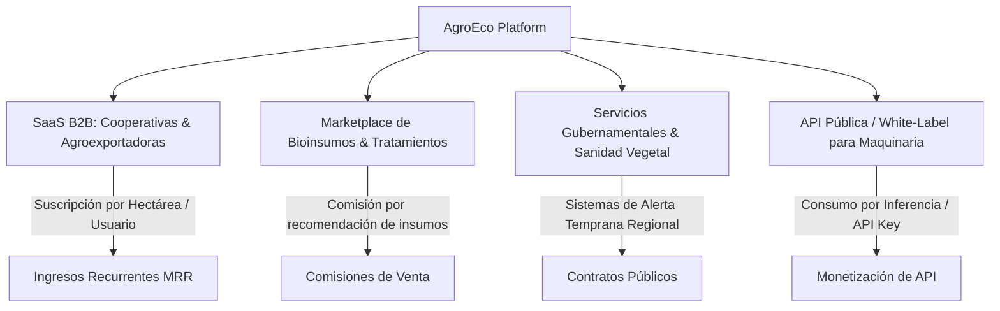

# AgroEco · Intelligent Crop Disease Detection & Georeferenced Monitoring Platform

<div align="center">


<p align="center">
  <strong>Plataforma integral de visión artificial, geolocalización satelital y trazabilidad agronómica diseñada para productores agrícolas, cooperativas y técnicos de campo.</strong>
</p>

<p align="center">
  <a href="#-propuesta-de-valor-y-visi%C3%B3n-comercial">Propuesta de Valor</a> •
  <a href="#-caracter%C3%ADsticas-principales">Características</a> •
  <a href="#-potencial-de-negocio-y-monetizaci%C3%B3n">Modelo de Negocio</a> •
  <a href="#-arquitectura-tecnol%C3%B3gica">Arquitectura</a> •
  <a href="#-cat%C3%A1logo-oficial-de-cultivos-y-patolog%C3%ADas">Catálogo Agronómico</a> •
  <a href="#-puesta-en-marcha-r%C3%A1pida">Guía de Inicio</a> •
  <a href="#-despliegue-gratuito-en-producci%C3%B3n">Despliegue</a>
</p>

</div>

---

## 🌾 Propuesta de Valor y Visión Comercial

Las enfermedades fitosanitarias causan pérdidas anuales superiores al **20% - 40% de la producción agrícola global**, amenazando la rentabilidad de los agricultores y la seguridad alimentaria. Tradicionalmente, los diagnósticos en campo son lentos, dependen de visitas técnicas esporádicas y carecen de un registro espacial georreferenciado que permita anticipar brotes epidémicos.

**AgroEco** transforma cualquier teléfono inteligente o computadora en un **laboratorio fitosanitario digital de alta precisión**:
1. **¿Qué está afectando al cultivo?** → Diagnóstico instantáneo asistido por Visión Artificial y Redes Convolucionales / Modelos Multimodales.
2. **¿Dónde ocurre el foco de infección?** → Captura GPS satelital y mapeo cartográfico en tiempo real para visualizar brotes antes de que se propaguen.
3. **¿Cuándo ocurrió y qué hacer?** → Fichas técnicas completas con medidas culturales, preventivas y curativas.
4. **¿Cómo ha evolucionado el caso?** → Trazabilidad longitudinal con bitácoras cronológicas, registro de tratamientos aplicados y métricas epidemiológicas.

> *"Inteligencia artificial para diagnosticar con certeza botánica, geolocalización satelital para contener el brote a tiempo y trazabilidad de datos para proteger la inversión agrícola."*

---

## 🚀 Características Principales

### 1. Diagnóstico Fitosanitario con IA Multimodal
* **Motor Dual / Resiliente:** Inferencia basada en red neuronal convolucional **MobileNetV3** (transfer learning adaptado a patologías vegetales) complementada con visión experta de **Google Gemini Vision API** y motor de contingencia determinista offline.
* **Contextualización por Órgano:** Análisis granular por parte vegetal (**hoja, tallo o fruto**) para evitar falsos positivos.
* **Índice de Confianza y Severidad:** Estimación probabilística del diagnóstico (`85% - 99%`) y clasificación por nivel de alerta (`Leve`, `Moderada`, `Alta`, `Severa`).

### 2. Mapeo Georreferenciado de Brotes (SIG / GIS)
* **Geolocalización Automática:** Obtención de coordenadas mediante Web Geolocation API con indicador de precisión satelital en metros.
* **Mapas Interactivos:** Desarrollados con Leaflet y OpenStreetMap, optimizados para dispositivos móviles rurales.
* **Filtros Espaciales:** Filtrado dinámico de focos por cultivo, severidad, estado epidemiológico y rango de fechas.

### 3. Gestión Integral de Fincas y Parcelas
* **Zonificación Agrícola:** Registro de múltiples predios con departamento, municipio, área total y subdivisiones por parcela.
* **Asociación de Cultivos:** Trazabilidad por tipo de cultivo y fecha de siembra para correlacionar edad fenológica con patologías comunes.

### 4. Seguimiento Evolutivo del Tratamiento
* **Ciclo de Vida del Caso:** Estados estandarizados: `Detectado` ➜ `En Seguimiento` ➜ `Controlado` ➜ `Resuelto`.
* **Bitácora de Campo:** Registro de notas agronómicas, dosis de tratamiento aplicadas y fotos evolutivas para medir la efectividad del manejo sanitario.

### 5. Analítica y Dashboard Ejecutivo
* **KPIs Fitosanitarios:** Indicadores en tiempo real de análisis totales, focos activos, casos controlados y predios bajo vigilancia.
* **Gráficos Estadísticos:** Visualizaciones interactivas con Recharts (distribución por cultivo, prevalencia por enfermedad y severidad acumulada).

### 6. Experiencia Mobile-First y PWA Offline
* **Sin Barreras de Instalación:** Funciona directamente desde el navegador web y se puede agregar como Progressive Web App (PWA) en iOS y Android.
* **Modo Demostración Inmediato:** Switch `NEXT_PUBLIC_DEMO_MODE=true` con persistencia en `localStorage` que permite presentar el sistema completo sin requerir credenciales externas.

---

## 💼 Potencial de Negocio y Monetización

AgroEco está concebido bajo una arquitectura modular y escalable que permite su evolución hacia diferentes modelos comerciales B2B y B2C:



1. **Suscripción SaaS para Cooperativas y Asociaciones:**
   Gestión centralizada de cientos de pequeños productores bajo una misma cuenta institucional con tableros agregados de sanidad regional.
2. **Marketplace de Soluciones Agronómicas:**
   Monetización por enlace a distribuidores autorizados de productos fitosanitarios orgánicos y convencionales basados en la enfermedad detectada.
3. **Certificación de Exportación y Buenas Prácticas Agrícolas (BPA):**
   Exportación de reportes de trazabilidad fitosanitaria exigidos por autoridades sanitarias (ICA, SENASA, USDA, GlobalG.A.P.).
4. **Venta / Licenciamiento Tecnológico:**
   Plataforma llave en mano atractiva para fondos de inversión AgriTech, empresas de insumos o agroindustrias.

---

## 🏛 Arquitectura Tecnológica

La plataforma implementa una arquitectura desacoplada y reactiva basada en microservicios:

```
AgroEco Monorepo
├── frontend/                     # Aplicación Next.js 14 (PWA, Tailwind, Leaflet, Recharts)
│   ├── public/                   # Manifest PWA, iconos y recursos estáticos
│   ├── src/
│   │   ├── app/                  # Rutas públicas y protegidas con App Router
│   │   ├── components/           # Componentes modulares (UI, Mapas, Dashboard)
│   │   ├── context/              # AuthContext y gestión de sesión
│   │   ├── demo/                 # Catálogo oficial y seed data para demo
│   │   ├── lib/                  # Clientes Firebase (Auth, Firestore, Storage) y API
│   │   └── types/                # Interfaces y esquemas TypeScript estrictos
│   └── package.json
│
├── backend/                      # Microservicio FastAPI (Python 3.11+)
│   ├── app/
│   │   ├── api/v1/endpoints/     # REST Endpoints (/health, /predict)
│   │   ├── core/                 # Configuración Pydantic y CORS seguro
│   │   ├── schemas/              # Modelos de validación de entrada/salida
│   │   └── services/ai/          # Predictor Convolucional, Gemini y Fallback
│   ├── tests/                    # Suite de pruebas automatizadas con Pytest
│   ├── requirements.txt
│   └── main.py
│
├── firestore.rules               # Reglas de seguridad declarativas auditadas (Zero-Trust)
├── storage.rules                 # Reglas de seguridad para evidencias fotográficas
├── scripts/                      # Poblador idempotente de base de datos
│   └── seed.py
└── docs/                         # Documentación de arquitectura, modelos y API
```

---

## 🌿 Catálogo Oficial de Cultivos y Patologías

El sistema cuenta con un catálogo exhaustivo precargado que abarca **6 cultivos estratégicos** y **20 patologías agronómicas clave**:

| Cultivo | Nombre Científico | Patologías Monitoreadas |
| :--- | :--- | :--- |
| **Plátano / Banano** | *Musa paradisiaca* | Sigatoka Negra (*Pseudocercospora fijiensis*), Moko (*Ralstonia solanacearum*), Mal de Panamá (*Fusarium oxysporum*), Antracnosis (*Colletotrichum musae*). |
| **Café** | *Coffea arabica* | Roya del Café (*Hemileia vastatrix*), Mancha de Hierro (*Cercospora coffeicola*), Ojo de Gallo (*Mycena citricolor*), Antracnosis (*Colletotrichum gloeosporioides*). |
| **Tomate** | *Solanum lycopersicum* | Tizón Temprano (*Alternaria solani*), Tizón Tardío (*Phytophthora infestans*), Mancha Bacteriana (*Xanthomonas vesicatoria*), Oídio (*Leveillula taurica*). |
| **Maíz** | *Zea mays* | Mancha de Asfalto (*Phyllachora maydis*), Roya Común (*Puccinia sorghi*), Carbón Común (*Ustilago maydis*). |
| **Frijol** | *Phaseolus vulgaris* | Antracnosis (*Colletotrichum lindemuthianum*), Mancha Angular (*Pseudocercospora griseola*), Roya del Frijol (*Uromyces appendiculatus*). |
| **Arroz** | *Oryza sativa* | Añublo del Arroz / Piricularia (*Pyricularia oryzae*), Mancha Marrón (*Bipolaris oryzae*). |

---

## ⚡ Puesta en Marcha Rápida

### Requisitos Previos
* **Node.js**: v18.17+ (recomendado LTS v20+)
* **Python**: v3.10+ (verificado con Python 3.11 / 3.14)
* **Git**

### 1. Clonar e Instalar Dependencias

```bash
# Backend (FastAPI)
cd backend
python -m pip install -r requirements.txt

# Frontend (Next.js)
cd ../frontend
npm install
```

### 2. Configurar Variables de Entorno

**Backend (`backend/.env`):**
```env
AI_MODE=mock                        # Opciones: "mock" | "model" | "gemini"
MODEL_PATH=app/services/ai/weights/crop_disease_mobilenet.pt
ALLOWED_ORIGINS=http://localhost:3000,http://127.0.0.1:3000
MAX_IMAGE_SIZE_MB=10
LOG_LEVEL=INFO
PORT=8000
HOST=0.0.0.0
```

**Frontend (`frontend/.env.local`):**
```env
# Modo Demostración activo por defecto para probar inmediatamente sin Firebase
NEXT_PUBLIC_DEMO_MODE=true
NEXT_PUBLIC_API_URL=http://localhost:8000
```

### 3. Ejecutar en Desarrollo

```bash
# Terminal 1: Iniciar Backend FastAPI
cd backend
python -m uvicorn main:app --reload --port 8000

# Terminal 2: Iniciar Frontend Next.js
cd frontend
npm run dev
```

* **Aplicación Web:** `http://localhost:3000`
* **Swagger API Docs:** `http://localhost:8000/docs`
* **Healthcheck:** `http://localhost:8000/health`

### 4. Pruebas Automatizadas

```bash
# Backend Pytest (7 pruebas automáticas)
cd backend
python -m pytest tests

# Frontend Unit Tests & Build
cd ../frontend
npm test
npm run build
```

---

## 🌐 Despliegue Gratuito en Producción

AgroEco está optimizado para desplegarse **100% gratis** con alta disponibilidad:

1. **Frontend (Vercel):**
   * Conecta tu repositorio en [Vercel](https://vercel.com).
   * Directorio raíz: `frontend`.
   * Agrega las variables `NEXT_PUBLIC_*` de producción.
2. **Backend (Render / Hugging Face):**
   * Crea un **Web Service gratuito** en [Render](https://render.com).
   * Directorio raíz: `backend`, comando: `uvicorn main:app --host 0.0.0.0 --port $PORT`.
3. **Base de Datos & Auth (Firebase Spark Plan):**
   * Despliega las reglas de seguridad auditadas:
     ```bash
     firebase deploy --only firestore:rules,storage
     ```

---

## 🔒 Auditoría de Seguridad (Zero-Trust)

La plataforma cuenta con un esquema de seguridad auditado mediante la skill `firebase-security-rules-auditor`:
* **Prevención de Escalada de Privilegios:** Reglas estrictas en Firestore que impiden la mutación no autorizada del rol de usuario (`administrador` vs `productor`).
* **Protección de Datos Personales (PII):** Acceso a perfiles restringido exclusivamente al propietario del predio.
* **Aislamiento Fotográfico:** Las evidencias fotográficas en Firebase Storage solo son accesibles por el usuario que registró el caso.
* **CORS Seguro:** Eliminación de comodines abiertos en combinación con credenciales web.

---

## ⚖️ Aviso Legal Agronómico

> **IMPORTANTE:** Los diagnósticos provistos por **AgroEco** corresponden a un **análisis preliminar asistido por modelos de inteligencia artificial y visión computarizada**. No sustituyen la inspección técnica presencial de un agrónomo certificado ni un análisis fitopatológico de laboratorio. La información botánica y de manejo sirve como guía orientativa de apoyo a la toma de decisiones del productor agrícola.

---

<div align="center">
  <sub>Desarrollado con pasión para la modernización digital del campo y la protección de los cultivos agrícolas. © 2026 AgroEco.</sub>
</div>
